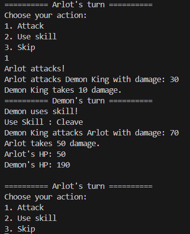
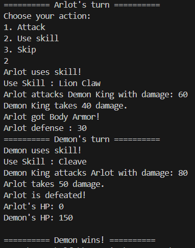
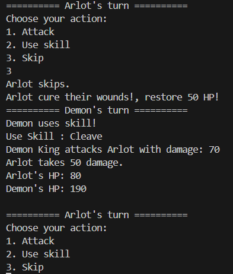
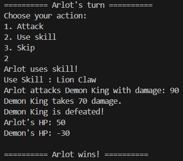

## Turn-Based Text-Based Game

Program ini adalah game turn based sederhana berbasis konsol, dimana player dapat memilih pilihan yang dilakukan untuk karakter yang dimainkannya. Tujuan game ini adalah player harus mengalahkan musuh.

### Cara Bermain
1. Setiap giliran, Anda memiliki tiga pilihan:
   - Serang: Melakukan serangan biasa kepada musuh.
   - Gunakan Skill: Menggunakan skill khusus karakter untuk memberikan dampak yang lebih besar kepada musuh.
   - Skip: Melewatkan giliran untuk melakukan pemulihan atau penyembuhan.

2. Musuh juga memiliki tiga pilihan yang dipilih secara acak setiap giliran:
   - Attack: Melakukan serangan biasa kepada karakter Anda.
   - Use Skill: Menggunakan skill khusus musuh untuk memberikan dampak yang lebih besar kepada karakter Anda.
   - Skip: Melewatkan giliran untuk melakukan pemulihan atau penyembuhan.

### Implementasi Konsep OOP
Program ini telah mengimplementasikan empat konsep dasar dalam Pemrograman Berorientasi Objek (OOP), yaitu:

1. **Encapsulation**: Setiap kelas di dalam program ini menggunakan encapsulation untuk menyembunyikan detail implementasi dari pengguna. Data dan metode yang terkait dengan setiap kelas hanya dapat diakses melalui antarmuka yang ditentukan.

2. **Inheritance**: Konsep inheritance digunakan untuk memungkinkan kelas turunan (subclass) mewarisi properti dan metode dari kelas induk (superclass). Dalam program ini, class Armor menjadi superclass untuk class headArmor dan classBody Armor
3. **Polymorphism**: Polymorphism memungkinkan objek untuk memperlakukan objek turunan seolah-olah mereka adalah objek dari kelas induknya. Dalam konteks permainan ini, polimorfisme dapat ditemukan dalam penggunaan metode yang sama dengan implementasi yang berbeda untuk karakter yang berbeda.

4. **Abstract dan Interface**: Penggunaan kelas abstrak dan antarmuka memungkinkan definisi umum untuk diterapkan di banyak kelas. Dalam program ini, saya membuat class Character sebagai class Abstract, lalu class weapon sebagai interface.

###Screenshot program

### Keterangan
Nama :  Muhammad Rizki Al-Fathir
NIM  :  1227050093
